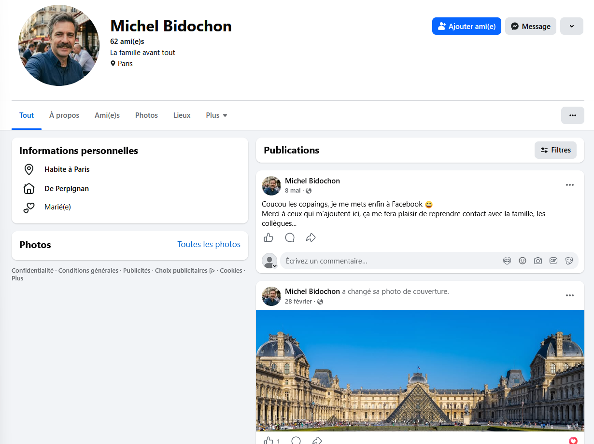
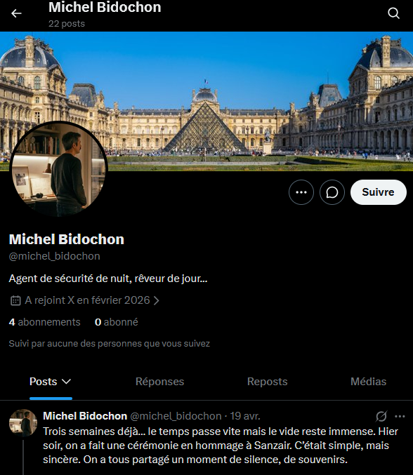
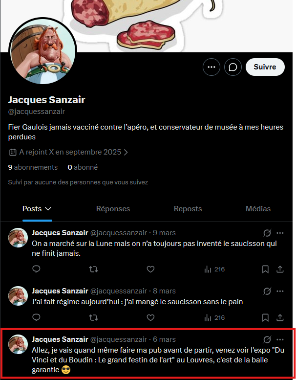
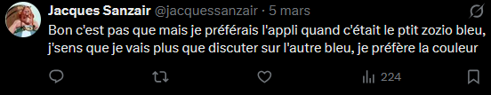
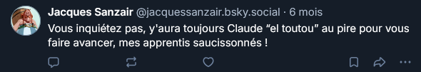
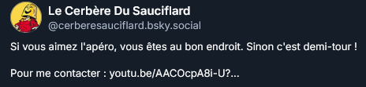
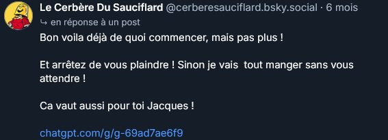
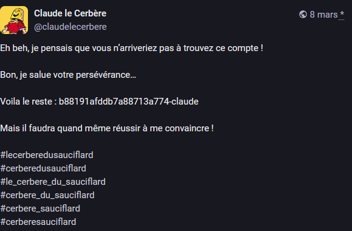
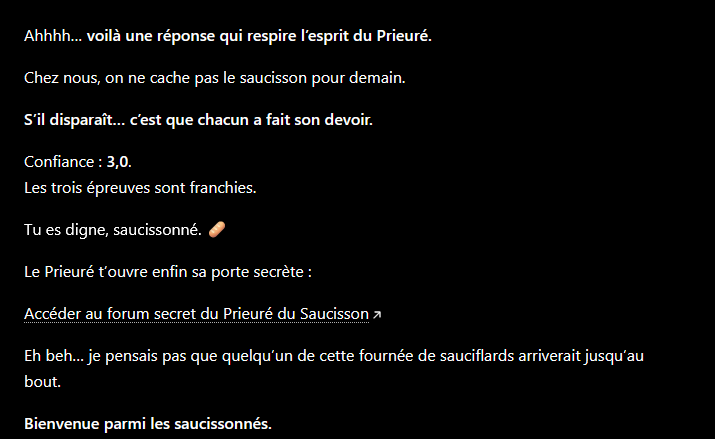

# Write Up - DaVinciClaude B2 - Clovis NOE

## Première partie : DaVinciClaude

### Enoncé

Le challenge parle d'un "Michel Bidochon" et d'un Jacques. Le flag attendu est le nom de l'exposition.

Premier reflex, chercher sur les différents réseaux sociaux Michel Bidochon.

#### Sur Facebook
On trouve un profil lié au Louvre, mais rien d'intéressant a retirer dans les publications et dans les amis. On peut noter qu'il a like un post d'une clé perdue à Paris, mais cela ne mene à rien.

#### Sur Twitter / X
Sur Twitter, c'est plus interessant. On a un compte avec le meme nom et la meme personne, mais beaucoup plus de messages. Parmis les messages on trouve le nom "Sanzair", dont il parle comme si il avait été tué. Ce qui peut le lier avec le fameux Jacques mort, dont on cherche l'exposition.

Sur Twitter aussi, on trouve un profil d'un Jacques Sanzair. Et dans ses messages, on trouve le nom d'une exposition au Louvre. On a donc trouvé le premier flag. 

## Deuxième partie : DaVinciClaude - B2 Le Prieuré du saucisson

### Enoncé

#### Sur Twitter / X
Sur le même profil, on a pas plus d'informations utile a récupérer, tous les messages n'ont pas l'air d'avoir d'intérêt. Il y en a un qui retiens l'attention

Apres une petite recherche google de type "réseau social bleu", on trouve BlueSky.

#### Sur BlueSky
On trouve également un profil similaire sur BlueSky, il y a beaucoup de posts et d'informations pour les autres challenges. Mais ce qui nous intéresse, c'est ce message : 

Il parle d'un Claude "el toutou" qui peut nous apprendre a devenir de meilleurs saucisonnés. On trouve des similarités avec l'énoncé, ou on cherche un claude qui s'occupe du recrutement. En cherchant dans les posts, on trouve pas plus d'informations.
En s'interessant aux abonnements, on trouve un profil qui ressort :

cerbere = toutou, apero = saucisson

Dans ce profil, on trouve quelques messages, mais le plus interessant est dans les réponses.

Un lien chatgpt. Quand on clique dessus, on tombe sur une 404 car le lien est en plusieurs parties.
En cherchant dans le reste du profil on trouve rien d'autre. 

Etant bloqué, je prend l'indice a disposition et c'est un emoji elephant. Petite recherche google : "réseau social élephant" et on trouve Mastodon.

#### Sur Mastodon
En cherchant cerberesauciflard (nom du compte BlueSky), on tombe sur un post qui nous donne la deuxième partie du lien : 

#### Sur le bot chatgpt
On tombe sur un chatbot custom qui nous donne une épreuve, apres quelques essais, on arrive a passer ses épreuves, et à la fin de l'entretien, il nous donne un le lien du forum. C'est le deuxième flag qui est trouvé.

